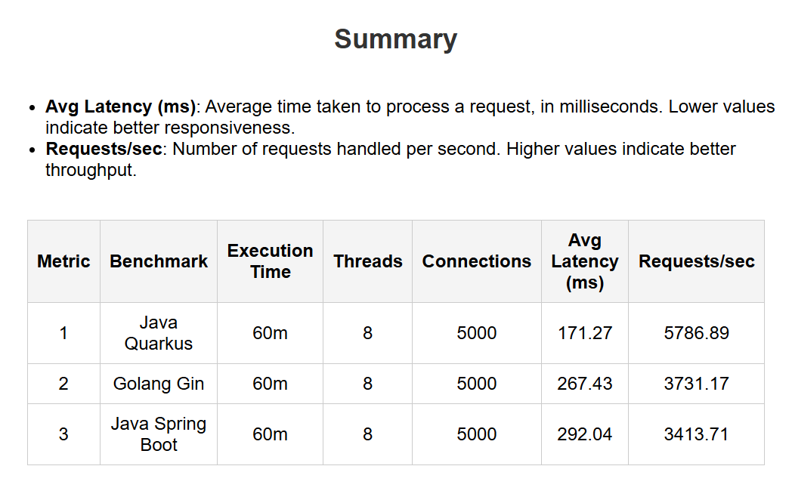
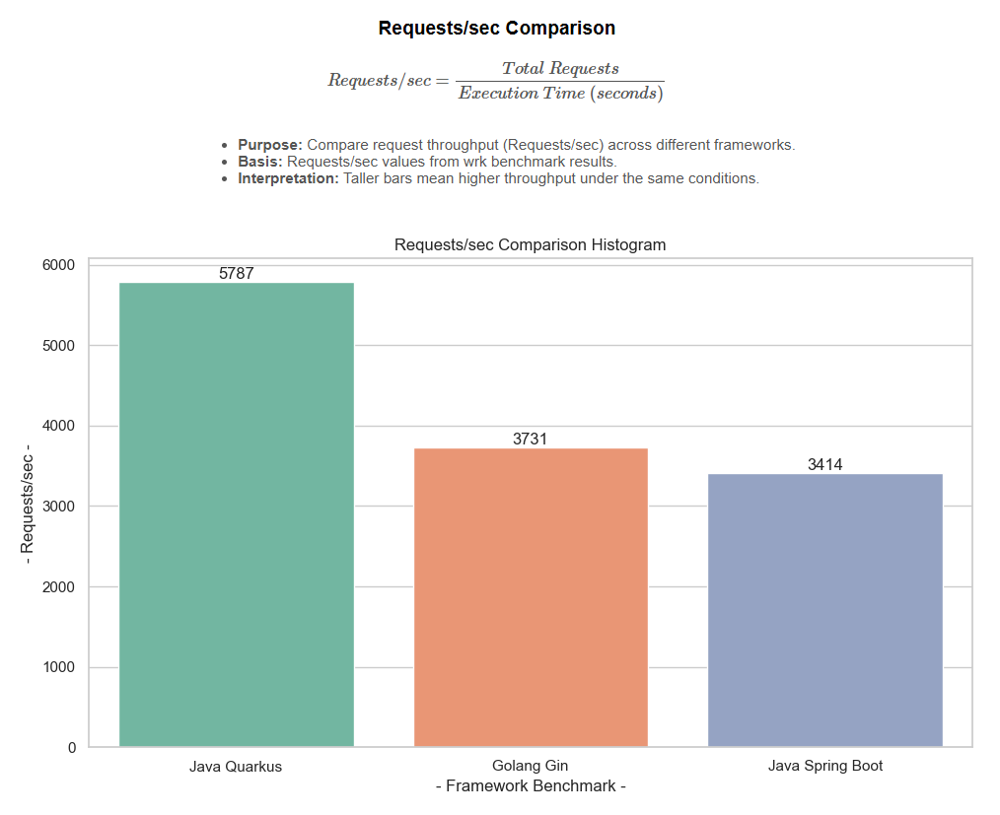
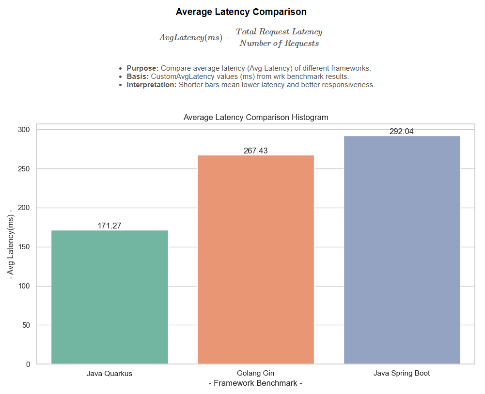
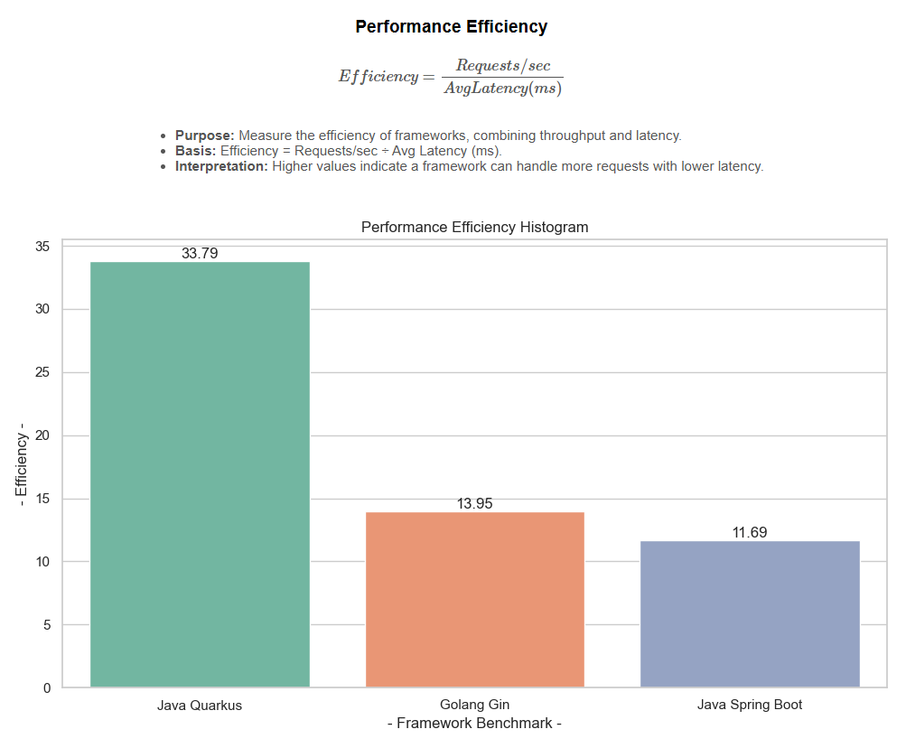

# **Benchmark Project**

This repository contains a benchmarking project to compare the performance of different frameworks  
using **wrk** benchmark tests. 

The frameworks included are:

- **Gin** (Go)
- **Quarkus** (Java)
- **Spring Boot** (Java)

Benchmark results include metrics such as **Requests/sec**, **Average Latency (ms)**, and **Performance Efficiency**.


## 🚀 **Quick Usage via GitHub Actions**

For a faster and automated way to run benchmarks,
this project provides a pre-configured GitHub Actions workflow that allows you to start benchmark tests directly from the Actions tab.

- Go to the **Actions** tab on this repository.
- Select the **Benchmark APIs** workflow.
- Choose your preferred benchmark mode (e.g., baseline, stress, or extreme).
- Click **Run workflow** to start the benchmark test.

Modes and their parameters:
    
| Mode          | Threads | Connections | Duration |
| ------------- | ------- | ----------- | -------- |
| ***short**    | 2       | 100         | 15s      |
| ***baseline** | 4       | 200         | 300s     |
| normal        | 8       | 1000        | 900s     |
| stress        | 8       | 2500        | 1800s    |
| extreme       | 8       | 5000        | 3600s    |

**Notice:**

- **Short test mode**: For development/testing purposes ONLY. Not recommended for real stress testing or production benchmarking.

- **Default mode**: If no mode is specified, the script will run in **baseline** mode.

After completion, you can:

 - Click into the workflow run you just triggered.
 - Scroll down to the bottom of the page and find the **Artifacts** section.
 - Download the generated benchmark report archive (.zip) file.
 - After extracting the archive, open the **benchmark_report** folder to view report details.

If you wish to continue with local development or manual benchmarking, please follow the next section for full setup and build instructions.


## ⚡ **Setup & Build Instructions**

This section explains step-by-step how to prepare, build, run and analyze the benchmarks for Gin, Quarkus, and Spring Boot in local host. Each command is shown in a code block, followed by its purpose.

1) Install WSL (Windows OS only):

    Provides a Linux-like environment on Windows for running tools like wrk and shell scripts without compatibility issues.
    ```bash
    wsl --install
    ```

1) Update package lists:

    Ensures apt has the latest metadata and fetches current versions of packages before installation.
    ```bash
    apt update
    ```

1) Install wrk:

    wrk is a modern HTTP benchmarking tool used in this project to generate load and measure throughput (Requests/sec) and latency performance.
    ```bash
    apt install wrk
    ```

1) Build and run services with Docker Compose:

    This builds Docker images for Gin, Quarkus, and Spring Boot, then starts them in isolated containers with consistent configs.
    ```bash
    docker compose up -d --build
    ```

1) Change directory to the project working folder:

    Navigate to the project directory mounted in WSL or Linux so that scripts can be executed. Replace {disk} and {java project} with your actual path.
    ```bash
    cd /mnt/{disk}/{java project}/java_go_benchmark
    ```

1) Grant execute permission:

    Make the benchmark script executable so it can be run directly.
    ```bash
    chmod +x wrk_test.sh
    ```

2) Run benchmark script:

    Use the following command to run load tests with different configurations:
    ```bash
    sudo ./wrk_test.sh <mode>
    ```

3) Install Python dependencies:

    Install required Python libraries (e.g., matplotlib, pandas) for analyzing and visualizing benchmark results.
    ```bash
    pip install -r requirements.txt
    ```

4) Run Python analysis script:

    Generates summary tables and comparison charts (saved in charts/). This step visualizes Requests/sec, Avg Latency, and Efficiency.
    ```bash
    python ./wrk_analysis.py
    ```


## 📄 **Benchmark Report**

The benchmark analysis generates a detailed HTML report located at:
`benchmark_report/report.html`



This report includes:
- Summary table of all benchmarks
- Requests/sec comparison chart
- Average latency comparison chart
- Performance efficiency chart


## 📊 **Benchmark Charts**

The report contains independent charts, which can also be obtained directly from the directory `benchmark_charts/`:








## 📜 **License**

This project is licensed under the Apache License 2.0.
You may obtain a copy of the License at:

    http://www.apache.org/licenses/LICENSE-2.0
